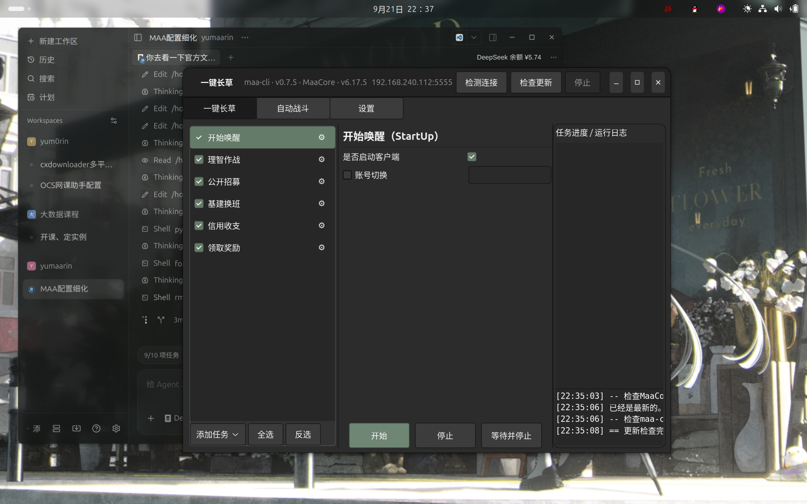

# yuMAArin

**一个 Linux(GNOME/GTK4) 上的《明日方舟》日常自动化图形前端**，后端用 [`maa-cli`](https://github.com/MaaAssistantArknights/maa-cli)
驱动，界面与设置项**对照官方 Windows 版 MAA（MaaWpfGui）逐项复刻**。

> 名字 = **yu** + **MAA** + **rin**（我的 ID）。



---

## 为什么会有这个东西

- 我用的是 **Linux（Ubuntu GNOME，Wayland）**。
- 官方 MAA 的图形界面 **`MaaWpfGui` 是 WPF 写的，只能在 Windows 跑**；官方在 Linux 上只提供命令行 `maa-cli`。
- 我**不太会用命令行，只会图形化界面**，而 Linux 这边又没有一个能用的图形界面
  （社区那个 Electron 的 `MaaX` 已归档、且和新版核心不兼容）。
- 所以我就**自己照着官方界面做了一个**。

现在它**大概能跑起来**：一键日常（开始唤醒 / 理智作战 / 公开招募 / 基建换班 / 信用收支 / 领取奖励）、
自动战斗、逐任务设置、进度与日志、定时、通知等都通了，**但还有很多东西没有充分测试、没有优化**，
细节也可能和官方有出入。欢迎提 issue，但请对完成度有个预期。

---

## 特性

- **一键长草**：左侧任务卡（可拖拽排序、勾选启用），中间逐任务设置，右侧运行日志。
- **对照官方复刻的设置**：客户端 / 触控 / 更新通道 / 主题 等下拉选项、以及各任务的默认值，
  均按官方 `MaaWpfGui`（`dev-v2`）逐字对齐；官方有解释（`TooltipBlock`）的项做成 **ⓘ 悬停说明**。
- **勾选门控 / 按等级勾选 / 动态联动**：如理智作战的「使用药剂/指定次数/指定材料」勾选后出现子项；
  公开招募「自动确认 3/4/5/6 星」各自勾选；肉鸽「主题→策略」联动；生息「主题→模式」联动；基建「换班设施」多选。
- **自动战斗**：普通作业 / 保全派驻 / 悖论模拟；作业 URI 可批量添加、按序连续运行。
- **实时日志 + 任务状态**：解析 `maa -v` 输出，任务状态/耗时显示在左侧任务卡上（运行中/完成/失败配色）。
- **设置**：连接（adb/地址/触控）、游戏（客户端）、启动（开机自启/启动后自动跑）、性能（ OCR ）、
  界面（主题跟随系统/通知）、三方服务、定时执行、外部通知（自定义 Webhook）、更新、维护等。
- **其他**：跟随系统深浅色、窗口尺寸记忆、**任务队列持久化**（重启不丢设置）、结束系统通知、自定义 Webhook。

---

## 依赖

| 组件 | 说明 |
|---|---|
| Python 3 + PyGObject(GTK4) | Ubuntu 24.04 自带 `gi`，无需 apt 安装 |
| [`maa-cli`](https://github.com/MaaAssistantArknights/maa-cli) | 后端，`~/.local/bin/maa`，并已 `maa install` 过核心与资源 |
| `adb` | 连接设备 |
| （可选）Waydroid / 模拟器 / 真机 | 运行游戏 |

> 本前端**不直接调用 MaaCore**，而是把界面上的设置写成 `maa-cli` 的任务文件，再调用 `maa run`。
> 因此官方「小工具」里的仓库识别/干员识别/抽卡等（需直连 MaaCore）**没有提供**。

---

## 安装

```bash
git clone https://github.com/Yum0Rin/yuMAArin.git
cd yuMAArin
./install.sh
```

安装脚本会把程序放到 `~/.local/share/yumaarin/`、入口放 `~/.local/bin/yumaarin`，
并写好桌面项与自启项（都会用你的 `$HOME`，不含硬编码路径）。

## 使用

- 应用菜单搜 **yuMAArin**，或终端 `yumaarin`。
- 「设置 → 连接」填设备地址（如 Waydroid 的 `192.168.240.112:5555`）→ 顶栏「检测连接」。
- 「一键长草」勾选要跑的任务 → 「开始」；运行日志在右侧，任务状态在左侧卡片上。

---

## 关于 maa-cli 配置

本前端使用 `~/.config/maa/` 下已有的配置（连接、实例、资源）：

- `~/.config/maa/profiles/default.json`：连接/实例/静态选项，由「设置」页写入。
- `~/.config/maa/tasks/ui.json`：每次运行时由本前端重写。
- `~/.config/yumaarin/queue.json`：任务队列记忆（模块/参数/勾选/顺序）。
- `~/.config/yumaarin/state.json`：窗口尺寸、主题、游戏与三方服务等设置。

首次使用请先确保 `maa-cli` 已安装并配置好设备（`maa install` / `maa update`）。

---

## 目录结构

```
yumaarin.py                 主程序（GTK4 单文件）
install.sh                  安装脚本
scripts/yumaarin-autostart.sh   开机自启包装（等 Waydroid 就绪）
scripts/backup-config.sh        备份运行配置
docs/screenshot.png         截图
```

---

## 已知限制 / 未完善

- **未充分测试、未优化**：主流程能跑通，边缘场景可能出错。
- **与官方存在出入**：部分官方设置是 WPF 宿主行为（脚本钩子、托盘、模拟器管理、成就、背景图、
  全局热键、部分外部通知渠道等），本前端未实现或实现方式不同。
- **无官方「小工具」页**：仓库识别/干员识别/公招识别/视频识别/抽卡/偷看/小游戏依赖直连 MaaCore，未提供。
- 肉鸽的「开局分队/职业组」目前是文本输入（官方是按主题的下拉，需核心资源数据）。
- 参数只暴露了常用项；更多可直接改 `yumaarin.py` 里的定义或直接用任务文件。

---

## 致谢

**本项目的存在完全建立在 [MAA（MaaAssistantArknights）](https://github.com/MaaAssistantArknights/MaaAssistantArknights)
的开源之上，特此感谢 MAA 团队与社区：**

- **`maa-cli`**（[仓库](https://github.com/MaaAssistantArknights/maa-cli)）：本前端的后端，所有自动化能力都来自它；
- **MaaCore**：识别与操作的核心；
- **MaaWpfGui**：本前端的界面、设置项、选项列表、默认值、解释文案等**均对照官方源码复刻**
  （`Views/UserControl/TaskQueue/*.xaml`、`Models/AsstTasks/*.cs`、`Res/Localizations/zh-cn.xaml` 等）；
- 以及 [prts.plus](https://prts.plus) 等社区网站提供的作业与资料。

感谢所有为 MAA 做出贡献的人。没有 MAA，就没有这个项目。

---

## 免责声明

- 本项目仅供学习与研究，**请遵守游戏服务条款**，使用自动化脚本的风险由使用者自行承担。
- 本项目与鹰角网络（Hypergryph）/ 明日方舟官方无关。
- 本项目与 MAA 官方组织无关，是个人自制的第三方前端；因使用本项目造成的任何后果，作者不承担责任。

## 许可证

[AGPL-3.0](LICENSE)（与 MAA 保持一致）。
